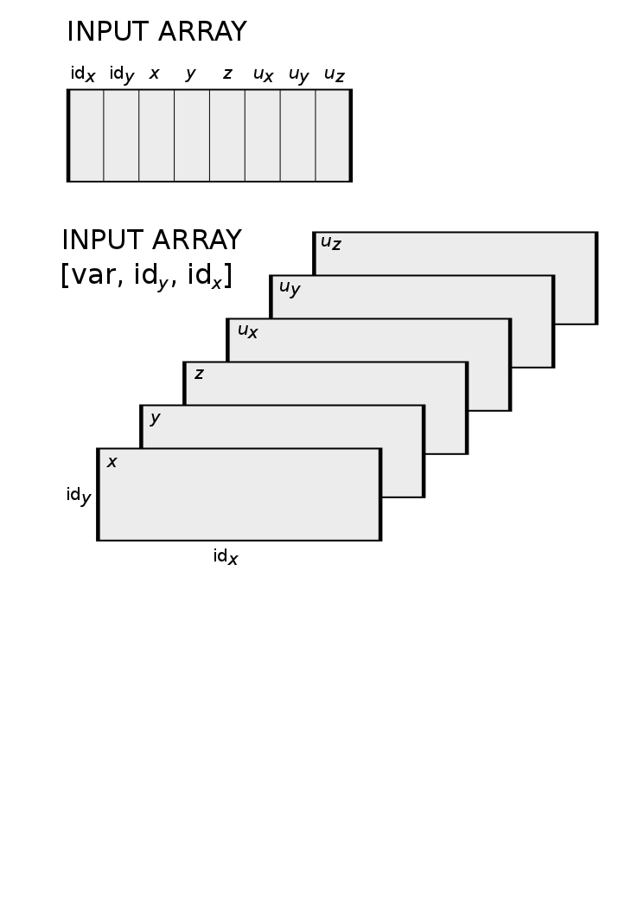

=================
AramisCDT
================= 
    

	

Facet coordinates :math:`\bm{X}^s_i,j`	

Facet displacement

.. math::
	\Delta\bm{X}^s_{i,j} = \bm{X}^s_{i,j} - \bm{X}^0_{i,j}\qquad \mathrm{for}\, s = 0 \ldots n_s, i = 0 \ldots n_i, j = 0 \ldots n_j

strain

.. math::
	\mathrm{d}\bm{X}^s_{i,j} = \bm{X}^s_{i,j} - \bm{X}^s_{i+1,j}\qquad \mathrm{for}\, s = 0 \ldots n_s, i = 0 \ldots n_i-1, j = 0 \ldots n_j

.. plot:: aramis_cdt/example_01.py

